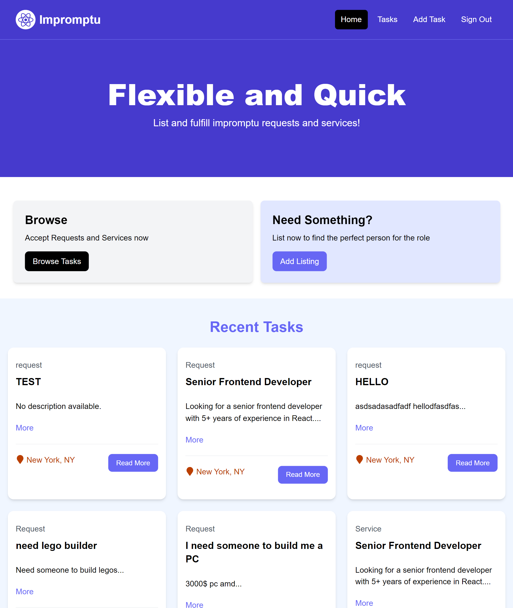

# This is the jobs listing project for Orbital 2024.

Built with react.js and tailwind CSS

Backend Repository: https://github.com/slye20/Impromptu-backend

Link to Deployed App: https://impromptu-frontend-f9cf.vercel.app/

Creators: Ng Ze Rui, Samuel Lim



### Install Dependencies

```bash
npm install
```

### Run Vite Frontend

React will run on http://localhost:3000

```bash
npm run dev
```

### Build for Production

```bash
npm run build
```

### Preview Production Build

```bash
npm run preview
```
